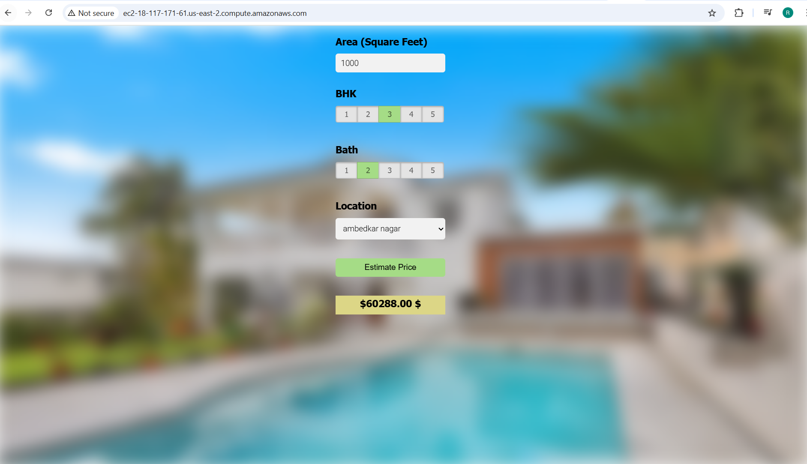

# BangloreHomePrices
I have built website for home price prediction for a city of Banglore.

Project Description
This is an end-to-end machine learning project that predicts home prices in Bangalore, India based on various features like square footage, number of bedrooms, and location. The project covers the complete data science pipeline from data cleaning and exploratory analysis to model building and deployment as a web application on AWS EC2.

## 📸 Preview




## 🛠️ Tech Stack & Tools

| Process                        | Technology / Tool / Library                      |
|-------------------------------|--------------------------------------------------|
| **Language**                  | Python                                           |
| **IDE**                       | Jupyter Notebook, VS Code, PyCharm              |
| **Data Cleaning**             | `pandas`, `numpy`                               |
| **Visualization**             | `matplotlib`                                    |
| **Feature Engineering**       | `pandas`, `numpy`, domain knowledge             |
| **Model Building & ML**       | `scikit-learn`                                   |
|                               | ↳ Linear Regression (for prediction)            |
|                               | ↳ GridSearchCV (for hyperparameter tuning)      |
|                               | ↳ K-Fold Cross Validation (for evaluation)      |
|                               | ↳ Feature engineering techniques                |
|                               | ↳ Dimensionality reduction                      |
|                               | ↳ Outlier detection and removal                 |
| **Web Framework**             | `Flask`                                         |
| **Frontend (UI)**             | HTML, CSS, JavaScript                           |
| **API Hosting**               | Flask running on port `5000`                    |
| **Web Server**                | NGINX                                           |
| **Deployment**                | AWS EC2 Instance (Ubuntu)                       |
| **File Transfer**             | WinSCP                                           |
| **SSH Access**                | `ssh` using PEM key                             |


## 🌐 Deployment on AWS EC2

This app is hosted on an AWS EC2 instance.

## 📂 Project Structure

```bash
BANGLOREHOMEPPRICES/
├── .idea/                              # IDE configuration files
├── .vscode/                            # VS Code workspace settings
│
├── client/                             # Frontend files
│   ├── app.css                         # Stylesheet
│   ├── app.html                        # Main HTML file
│   └── app.js                          # JavaScript for UI logic
│
├── model/                              # Data and trained model files
│   ├── banglore_home_prices_model.pkl  # Trained ML model
│   ├── banglore_home_prices_data.csv   # Processed dataset
│   ├── Bengaluru_House_Data.csv        # Original dataset
│   └── columns.json                    # Feature columns for prediction
│
├── server/                             # Backend and API
│   ├── __pycache__/                    # Compiled Python files
│   ├── artifacts/                      # Model artifacts
│   ├── requirements.txt                # Python dependencies
│   ├── server.py                       # Flask server entrypoint
│   └── util.py                         # Utility functions for prediction
│
└── README.md                           # Project documentation


